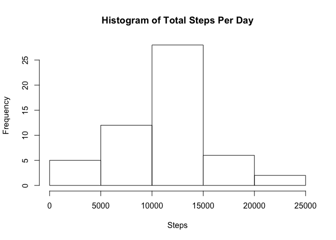

## Loading and processing the data


```r
unzip("activity.zip")
data <- read.csv("activity.csv", sep = ",", na.strings = "NA")
```

## Mean of total number of steps taken each day


```r
day <- aggregate(steps ~ date, data, sum)
hist(day$steps, xlab = "Steps", main = "Histogram of Total Steps Per Day")
```

<!-- -->

Calculate the mean and median of total number of steps per day:

```r
meanDay <- as.integer(mean(day$steps))
medDay <- median(day$steps)
```

The mean of the total number of steps is **10766**, and the median is **10765** steps.

## Average daily activity pattern


```r
intMean <- aggregate(steps ~ interval, data, mean)
plot(intMean$interval, intMean$steps, type = "l", xlab = "Intervals", ylab = "Average Steps", main = "Average Steps Taken of Each Interval")
```

<!-- -->

Find the the interval that have the maximum number of steps:


```r
maxInt <- intMean[which.max(intMean$steps),]
mInt <- maxInt[1, 1]
```

The **835** interval contains the maximum number of steps.

## Imputing missing values

1. Calculate total number of missing values

```r
naNum <- sum(is.na(data$steps))
```
There are **2304** missing values.

2. Filling the missing value with corresponding average interval steps


```r
dataSplit <- split(data, data$interval)

for (i in 1:length(dataSplit)) {
        dataSplit[[i]]$steps[is.na(dataSplit[[i]]$steps)] <- round(intMean[i, 2])
}
```

3. Create new dataset with the missing data filled in


```r
dataImputed <- do.call("rbind", dataSplit)
dataImputed <- dataImputed[order(dataImputed$date), ]
```

4. Make the histogram and calculate the mean and median total number of steps per day

Make the histogram:

```r
dayNew <- aggregate(steps ~ date, dataImputed, sum)
hist(dayNew$steps, xlab = "Steps", main = "Total Steps Per Day with Filled Missing Value")
```

<!-- -->

Calculate the mean and median of total number of steps per day:

```r
meanDayNew <- as.integer(mean(dayNew$steps))
medDayNew <- median(dayNew$steps)
```

The mean of the total number of steps with missing value filled is **10765**, and the new median is **10762** steps.

The mean of total steps taken each day decreases **1** step, the median decreases **3** steps.

## Difference in activity patterns between weekdays and weekends

1. Create new dataset with weekday variable:

```r
w <- c('Monday', 'Tuesday', 'Wednesday', 'Thursday', 'Friday')
t <- as.Date(dataImputed$date)

# Create factor
weekDays <- factor((weekdays(t) %in% w), levels=c(FALSE, TRUE), labels=c('weekend', 'weekday'))

# Combine dataset with weekdays vector
dataImputedWeekdays <- cbind(dataImputed, weekDays)
colnames(dataImputedWeekdays)[4] <- "weekday/weekend"
```

2. Make the plot that compares number of steps taken of each interval of weekday and weekend days


```r
# Calculate mean interval steps of weekday and weekend
intMeanWeekday <- tapply(dataImputedWeekdays[dataImputedWeekdays$`weekday/weekend` == "weekday", ]$steps, dataImputedWeekdays[dataImputedWeekdays$`weekday/weekend` == "weekday", ]$interval, mean)
intMeanWeekend <- tapply(dataImputedWeekdays[dataImputedWeekdays$`weekday/weekend` == "weekend", ]$steps, dataImputedWeekdays[dataImputedWeekdays$`weekday/weekend` == "weekend", ]$interval, mean)

# Make the plot
par(mfcol = c(2, 1))
plot(intMean$interval, intMeanWeekday, type = "l", xlab = "Steps", ylab = "Interval", main = "weekday")
plot(intMean$interval, intMeanWeekend, type = "l", xlab = "Steps", ylab = "Interval", main = "weekend")
```

<!-- -->
